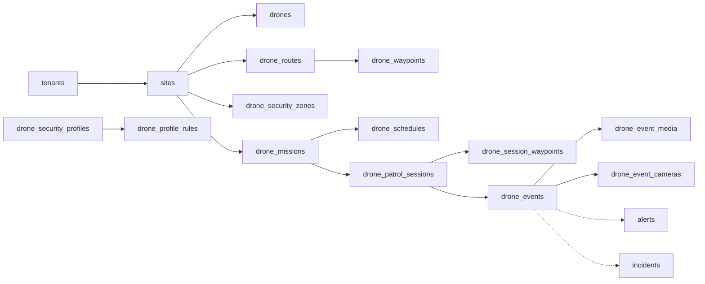
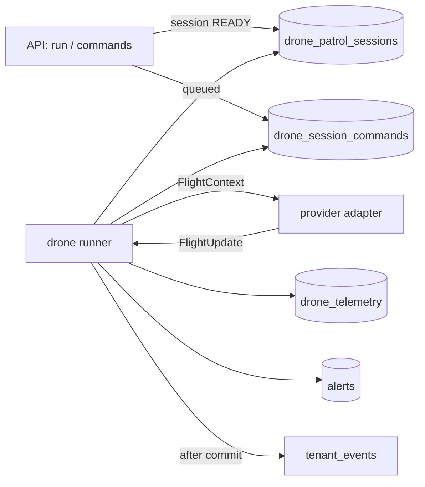

# Drone Patrol — Architecture

**As of:** 2026-09-25 · **Built so far:** Phase 2, the data model (migration `0123`);
Phase 3, the API; Phase 4, flying — the provider abstraction, the simulator,
pre-flight, the command queue and the drone runner (migration `0124`); and
Phase 5, the site edge gateway (migration `0125`); and Phase 6, detection to
security event (migration `0126`). 75 operations, described in
`DRONE_PATROL_API.md`; running it is in `DRONE_PATROL_OPERATIONS.md`, the edge
gateway in `DRONE_PATROL_EDGE.md`, the AI in `DRONE_PATROL_AI.md`, adding a real
aircraft in `DRONE_PATROL_PROVIDER_INTEGRATION.md`.
This document describes what exists. Anything not yet built is listed at the end
and is not described as if it were. The analysis behind the design is
`DRONE_PATROL_GAP_ANALYSIS.md`.

## Principles

- **Additive only.** Every table is new and prefixed `drone_`. No existing table
  gained a column or changed a constraint. New tables point at existing rows
  (sites, cameras, users, alerts, incidents); existing tables know nothing about
  drones.
- **Invariants live in the database.** One flight per drone, one session per
  scheduled run, no duplicate telemetry, zones that are real shapes — each is a
  constraint, so no amount of retrying, restarting or racing can violate it.
- **History is copied, not referenced.** A session carries the names and a
  snapshot of the configuration it flew, so editing or deleting a mission, route
  or drone never rewrites what already happened.

## Data model

Dotted lines point at existing tables. Telemetry (`drone_telemetry`) belongs to
a drone and, while flying, a session; it is omitted above for clarity.

| Table | Holds | Key rule |
|---|---|---|
| `drone_module_licenses` | Whether a tenant has the module, until when, and its limits | One row per tenant. No row, disabled or expired = off |
| `drone_provider_configs` | Connection settings for a provider adapter | Secret stored encrypted, apart from `config` |
| `drone_edge_gateways` | A site's edge device | Only the SHA-256 of its credential is stored |
| `drones` | The fleet, with live health and position | `code` unique per tenant; `camera_id` is the camera row that carries its video (decision D1) |
| `drone_maintenance_logs` | Services, inspections, battery and firmware changes, faults | — |
| `drone_security_zones` | Map-space polygons, rectangles and circles | A circle needs a centre and radius; a polygon needs 3+ points |
| `drone_security_profiles`, `drone_profile_rules` | Reusable AI rule sets per module | One rule per module per profile |
| `drone_routes`, `drone_waypoints` | A base point and an ordered path | Sequence unique per route, deferrable so a route can be reordered in one transaction |
| `drone_missions` | Site + drone + route + profile | Unique name per tenant |
| `drone_schedules` | ONCE, DAILY, WEEKLY, SELECTED_DAYS, SPECIFIC_DATE, in a named timezone | SELECTED_DAYS needs days; SPECIFIC_DATE needs dates |
| `drone_patrol_sessions` | One row per execution | Unique `(schedule_id, scheduled_for)`; at most one in-flight session per drone |
| `drone_session_waypoints` | The route as flown, waypoint by waypoint | Copied at start |
| `drone_telemetry` | Position, altitude, heading, speed, battery, gimbal | Partitioned monthly; unique `(drone_id, recorded_at)` |
| `drone_events` | A detection after context: where, which zone, what risk | AI confidence (0–1) and risk score (0–100) are separate columns |
| `drone_event_media` | Snapshots and pre/event/post clips | Outside `evidence`, so outside the retention purge |
| `drone_event_cameras` | Fixed cameras correlated with an event | Camera name copied, so a deleted camera still reads |

## State vocabularies

**Drone status:** `OFFLINE`, `STANDBY`, `READY`, `PREPARING`, `MISSION_ACTIVE`,
`RETURNING`, `CHARGING`, `WARNING`, `COMMUNICATION_LOST`, `CRITICAL`,
`MAINTENANCE`, `DISABLED`. `DISABLED` is the soft delete: a drone with flight
history is disabled, not removed.

**Session status:** `SCHEDULED`, `PRECHECK`, `READY`, `LAUNCHING`, `ACTIVE`,
`PAUSED`, `EVENT_DETECTED`, `RETURNING`, `COMPLETED`, `FAILED`, `ABORTED`,
`CANCELLED`, `BLOCKED` (pre-flight refused), `MISSED` (never started within
grace). The seven from `PRECHECK` to `RETURNING` are "in flight"; a drone may have
at most one session in any of them.

**Event risk:** `INFO`, `LOW`, `MEDIUM`, `HIGH`, `CRITICAL`, with a 0–100 score
and a list of the factors that produced it. **Event location:** the drone's
position is recorded as fact; a projected object position, where one exists, is
marked `PROJECTED`.

## Idempotency

| Duplicate source | Stopped by |
|---|---|
| Scheduler restart, two workers, a retry | `uq_dps_execution (schedule_id, scheduled_for)` |
| Starting a drone that is already flying | `uq_dps_one_flight_per_drone` (partial, in-flight states) |
| A command pressed twice, or by two operators | `uq_dcmd_one_pending (session_id, command)` (partial, pending) |
| A gateway resending a flight update | `edge_seq` on the session: only a higher update number is applied |
| A gateway resending a whole batch | `uq_dsr_batch (gateway_id, batch_id)`: the stored answer is replayed |
| Reading a flight's detections again, or a sighting resent | `uq_dobs_detection`, `uq_dobs_client_ref` on `drone_observations` |
| Two runners, or a runner restart | Sessions and commands claimed `FOR UPDATE SKIP LOCKED`; flight state lives on the session |
| Edge resending a session, event or media file | `client_ref` unique on each |
| Edge resending a telemetry sample | `(drone_id, recorded_at)` unique |

## Tenant isolation

All 21 tables have `FORCE ROW LEVEL SECURITY` with the same policy text as every
other table in the system:
`tenant_id = current_setting('app.current_tenant', true)::uuid`. On the
partitioned telemetry table the parent's policy governs every partition.

Deletion never blocks: every tenant foreign key cascades and every other foreign
key sets NULL.

## Permissions

| Permission | Admin | Manager | Supervisor | Operator | Guard | Viewer |
|---|:-:|:-:|:-:|:-:|:-:|:-:|
| `drone:read` | ✓ | ✓ | ✓ | ✓ | | ✓ |
| `drone:create` / `update` / `delete` | ✓ | ✓ | | | | |
| `drone:operate` | ✓ | ✓ | ✓ | ✓ | | |
| `drone:mission:create` / `update` | ✓ | ✓ | ✓ | | | |
| `drone:mission:execute` / `abort` | ✓ | ✓ | ✓ | ✓ | | |
| `drone:event:read` | ✓ | ✓ | ✓ | ✓ | ✓ | ✓ |
| `drone:event:acknowledge` / `investigate` | ✓ | ✓ | ✓ | ✓ | | |
| `drone:maintenance:read` | ✓ | ✓ | ✓ | | | |
| `drone:maintenance:manage` | ✓ | ✓ | | | | |
| `drone:report:read` | ✓ | ✓ | ✓ | ✓ | | ✓ |
| `drone:report:export` | ✓ | ✓ | ✓ | | | |

Super Admin and Client hold none: the platform owner licenses the module and
watches its health, and does not operate tenants' drones. Anyone who can start a
flight can abort it — a test enforces that.

## Licensing and billing

`drone_patrol` is listed in `billing_modules` (per site, priced at zero until a
price is set). A tenant has the module when its `drone_module_licenses` row is
enabled and unexpired. The entitlement deliberately does **not** live in
`tenant_module_licenses`; see the gap analysis §19.1.

## API layer

| Piece | Where | Does |
|---|---|---|
| Licence gate | `dependencies/drone_module.py` | Refuses creating, changing and flying without an enabled, unexpired `drone_module_licenses` row; counts limits under a per-tenant advisory lock so two requests cannot both take the last slot |
| Fleet | `routers/drones.py` | Drones, provider configs, edge gateways, maintenance, telemetry reads, dashboard, entitlement |
| Planning | `routers/drone_planning.py` | Zones, security profiles, routes and waypoints, missions, schedules |
| Operations | `routers/drone_operations.py` | Sessions, flight tracks, events and the decisions on them |
| Platform | `routers/platform_drone_licenses.py` | Super Admin grants the licence per tenant |
| Schedules | `services/drone_schedule.py` | Pure occurrence logic in the schedule's own timezone; used by the preview and by the drone runner |
| Geometry | `services/drone_geometry.py` | Zone shapes, point-in-zone, route length, off-site waypoints — on top of `geofence.py` |
| Provider catalogue | `services/drone_provider_registry.py` | Which providers exist and what their settings are; the simulator only |
| Shared | `services/drone_access.py` | Site visibility (404 outside), scoping clauses, audit |

Two rules shape every endpoint:

- **Reads and event decisions are never licence-gated.** A lapsed licence must not
  hide evidence or stop an operator closing an event raised before it lapsed.
- **Nothing is read after a commit.** The tenant setting is transaction-local, so
  a query after `commit()` runs with no tenant and fails. Every endpoint reads its
  response inside the transaction, then commits.

The only changes to existing files are registration: 11 added lines in `main.py`
(imports, `include_router` calls and tag descriptions), and the new
`drone-runner` service in `docker/docker-compose.yml`. Nothing existing changed.

## Flying (Phase 4)

| Piece | Where | Does |
|---|---|---|
| Flight plan | `services/drone_flight_plan.py` | Pure: builds the plan from a route and its waypoints, the timeline of takeoff, legs, dwells and landing, the estimate (duration, distance, battery), and the frozen configuration snapshot |
| Providers | `services/drone_providers/` | The `DroneProvider` interface, declared capabilities, and the adapters. Only `simulator` exists |
| Simulator | `services/drone_providers/simulator.py` | Flies the plan in simulated time: battery drain, pause, return home, low-battery return at 20%, lost link, motor fault. Failures are chosen by hashing the session id, so every flight replays exactly |
| Pre-flight | `services/drone_preflight.py` | Pure: 18 blocking checks and 3 warnings, every one with a reason a person can act on |
| Sessions | `services/drone_sessions.py` | Loading a mission, creating a session with its snapshot, recording what a provider reports, raising alerts once |
| Runner | `services/drone_runner.py`, `drone_runner_main.py` | Carries out commands, launches ready sessions, flies live ones, creates scheduled sessions, polls drone health |

**The runner is its own process** (`drone-runner` in compose). The scheduler's
60-second loop also escalates man-down SOS; a slow drone provider must never
delay that, and an abort must be carried out in seconds, not at the next minute.

**A session flies its snapshot.** The plan comes from the configuration frozen
when the session was created, never the live tables, so editing a route while a
drone flies it changes nothing mid-air — and the launch-time pre-flight re-check
is against the frozen route too.

**Every provider call has a 10-second timeout.** A flight that has not been heard
from for 10 minutes is closed as `FAILED` and alerted, whatever the provider
thinks.

**Alerts go through the existing pipeline.** Drone alerts are rows in `alerts`
(module `drone_patrol`) announced as `alert_created` after the transaction
commits, so notification rules, push, webhooks and every alert screen handle them
unchanged, and nothing is announced that was then rolled back.

**Migration `0124`** adds `drone_session_commands`, five columns on
`drone_patrol_sessions` (`provider_state`, `last_tick_at`, `landed_at`,
`comms_lost_at`, `failure_code`), `drones.comms_alerted_at`, and
`drone_runner_tenants()` — a `SECURITY DEFINER` function that tells the runner
which tenants have work (licensed, flying, or with commands waiting) without the
runner bypassing row-level security. All drone-owned; nothing existing changed.

## The site edge gateway (Phase 5)

A drone registered with an edge gateway is flown **at its site**, by the
`drone-edge` service, with the provider adapter installed there — provider code
stays out of the central API. The session records its gateway when it is created;
the central runner then only watches over it.

| Piece | Where | Does |
|---|---|---|
| Wire format | `services/drone_edge_wire.py` | The batch, its bounds, and FlightUpdate to JSON and back — imported by both ends |
| Central side | `services/drone_edge_sync.py`, `routers/drone_edge.py` | Recognises a gateway by its credential under its tenant's RLS; applies its batch item by item in savepoints; hands it its work; accepts the files the policy asks for |
| The gateway | `drone_edge/agent.py`, `store.py`, `central.py`, `drone_edge_main.py` | Flies, buffers in a local SQLite outbox, syncs, claims, uploads; no database, no web framework |
| Watching over it | `services/drone_runner.py` | An unclaimed edge session is missed after 10 minutes; a silent one is failed after 60 as `EDGE_UNREACHABLE`; a silent gateway is marked `OFFLINE` with one alert |

**Shared rules.** Pre-flight before launch, recording a flight update, health,
closing a command and ending a session are the same functions whether the central
runner or a gateway flew the drone (`drone_sessions.recheck_before_launch`,
`record_update`, `apply_health`, `finish_command`, `end_session`), so where a drone
was flown from never changes its record.

**A late record corrects a guess.** A flight the runner closed as
`EDGE_UNREACHABLE` is replaced by the gateway's own record when it reconnects. No
other ended session is reopened.

**Migration `0125`** adds `drone_sync_receipts`, the gateway's reported health on
`drone_edge_gateways`, `edge_seq` and `edge_claimed_at` on sessions,
`delivered_at` on commands and `edge_gateway_id` on media, and widens
`drone_runner_tenants()` to tenants with a gateway that has not gone offline.
Drone-owned only.

The two changes outside the drone module are registration again: the edge router
in `main.py` (3 lines) and the opt-in `drone-edge` compose service with its volume.

## AI: detection to security event (Phase 6)

The AI workers are not changed: a drone's camera is a camera, and its detections
are ordinary `detections` rows. The drone runner's AI job reads each flying
drone's new detections (with the module's own row — plate, watchlist verdict —
and the worker's own alert, if any), and `drone_ai_pipeline.observe()` takes each
through context, grouping, risk, verification and alerting. A sighting from a
site edge gateway enters the same function. The rules themselves are pure
(`drone_ai.py`).

Every detection that feeds an event is kept in `drone_observations`, unique on
`detection_id` and on the gateway's `client_ref`, so re-reading is harmless and
an event shows what it rests on. Alerts go into the existing `alerts` table as
`drone.<module>`; a worker's alert that is already as serious is linked instead,
never repeated. The workers still alert on their own — a decision for the owner,
in `DRONE_PATROL_AI.md`.

**Migration `0126`** adds `drone_observations`, grouping and verification columns
on `drone_events` (`label`, `last_detected_at`, `detection_count`, `attributes`,
`verified_at`, `risk_evaluated_at`, `source`) and `drone_patrol_sessions.
ai_watermark_at`. Drone-owned only.

## Not built yet

CCTV correlation (7), incident integration (8), screens (9), mobile
(10), reports (11), analytics (12). No real drone, SDK or edge hardware is
connected, and none will be claimed until it is: every flight so far is the
simulator's.
