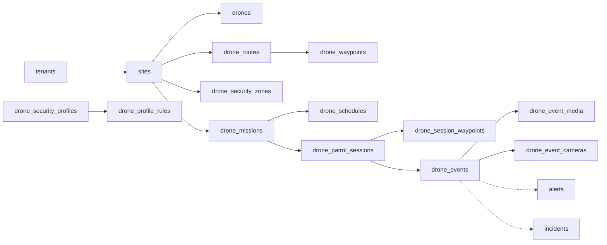

# Drone Patrol — Architecture

**As of:** 2026-09-25 · **Built so far:** Phase 2, the data model (migration `0123`).
This document describes what exists. Anything not yet built is listed at the end
and is not described as if it were. The analysis behind the design is
`DRONE_PATROL_GAP_ANALYSIS.md`.

## Principles

- **Additive only.** Every table is new and prefixed `drone_`. No existing table
  gained a column or changed a constraint. New tables point at existing rows
  (sites, cameras, users, alerts, incidents); existing tables know nothing about
  drones.
- **Invariants live in the database.** One flight per drone, one session per
  scheduled run, no duplicate telemetry, zones that are real shapes — each is a
  constraint, so no amount of retrying, restarting or racing can violate it.
- **History is copied, not referenced.** A session carries the names and a
  snapshot of the configuration it flew, so editing or deleting a mission, route
  or drone never rewrites what already happened.

## Data model

Dotted lines point at existing tables. Telemetry (`drone_telemetry`) belongs to
a drone and, while flying, a session; it is omitted above for clarity.

| Table | Holds | Key rule |
|---|---|---|
| `drone_module_licenses` | Whether a tenant has the module, until when, and its limits | One row per tenant. No row, disabled or expired = off |
| `drone_provider_configs` | Connection settings for a provider adapter | Secret stored encrypted, apart from `config` |
| `drone_edge_gateways` | A site's edge device | Only the SHA-256 of its credential is stored |
| `drones` | The fleet, with live health and position | `code` unique per tenant; `camera_id` is the camera row that carries its video (decision D1) |
| `drone_maintenance_logs` | Services, inspections, battery and firmware changes, faults | — |
| `drone_security_zones` | Map-space polygons, rectangles and circles | A circle needs a centre and radius; a polygon needs 3+ points |
| `drone_security_profiles`, `drone_profile_rules` | Reusable AI rule sets per module | One rule per module per profile |
| `drone_routes`, `drone_waypoints` | A base point and an ordered path | Sequence unique per route, deferrable so a route can be reordered in one transaction |
| `drone_missions` | Site + drone + route + profile | Unique name per tenant |
| `drone_schedules` | ONCE, DAILY, WEEKLY, SELECTED_DAYS, SPECIFIC_DATE, in a named timezone | SELECTED_DAYS needs days; SPECIFIC_DATE needs dates |
| `drone_patrol_sessions` | One row per execution | Unique `(schedule_id, scheduled_for)`; at most one in-flight session per drone |
| `drone_session_waypoints` | The route as flown, waypoint by waypoint | Copied at start |
| `drone_telemetry` | Position, altitude, heading, speed, battery, gimbal | Partitioned monthly; unique `(drone_id, recorded_at)` |
| `drone_events` | A detection after context: where, which zone, what risk | AI confidence (0–1) and risk score (0–100) are separate columns |
| `drone_event_media` | Snapshots and pre/event/post clips | Outside `evidence`, so outside the retention purge |
| `drone_event_cameras` | Fixed cameras correlated with an event | Camera name copied, so a deleted camera still reads |

## State vocabularies

**Drone status:** `OFFLINE`, `STANDBY`, `READY`, `PREPARING`, `MISSION_ACTIVE`,
`RETURNING`, `CHARGING`, `WARNING`, `COMMUNICATION_LOST`, `CRITICAL`,
`MAINTENANCE`, `DISABLED`. `DISABLED` is the soft delete: a drone with flight
history is disabled, not removed.

**Session status:** `SCHEDULED`, `PRECHECK`, `READY`, `LAUNCHING`, `ACTIVE`,
`PAUSED`, `EVENT_DETECTED`, `RETURNING`, `COMPLETED`, `FAILED`, `ABORTED`,
`CANCELLED`, `BLOCKED` (pre-flight refused), `MISSED` (never started within
grace). The seven from `PRECHECK` to `RETURNING` are "in flight"; a drone may have
at most one session in any of them.

**Event risk:** `INFO`, `LOW`, `MEDIUM`, `HIGH`, `CRITICAL`, with a 0–100 score
and a list of the factors that produced it. **Event location:** the drone's
position is recorded as fact; a projected object position, where one exists, is
marked `PROJECTED`.

## Idempotency

| Duplicate source | Stopped by |
|---|---|
| Scheduler restart, two workers, a retry | `uq_dps_execution (schedule_id, scheduled_for)` |
| Starting a drone that is already flying | `uq_dps_one_flight_per_drone` (partial, in-flight states) |
| Edge resending a session, event or media file | `client_ref` unique on each |
| Edge resending a telemetry sample | `(drone_id, recorded_at)` unique |

## Tenant isolation

All 18 tables have `FORCE ROW LEVEL SECURITY` with the same policy text as every
other table in the system:
`tenant_id = current_setting('app.current_tenant', true)::uuid`. On the
partitioned telemetry table the parent's policy governs every partition.

Deletion never blocks: every tenant foreign key cascades and every other foreign
key sets NULL.

## Permissions

| Permission | Admin | Manager | Supervisor | Operator | Guard | Viewer |
|---|:-:|:-:|:-:|:-:|:-:|:-:|
| `drone:read` | ✓ | ✓ | ✓ | ✓ | | ✓ |
| `drone:create` / `update` / `delete` | ✓ | ✓ | | | | |
| `drone:operate` | ✓ | ✓ | ✓ | ✓ | | |
| `drone:mission:create` / `update` | ✓ | ✓ | ✓ | | | |
| `drone:mission:execute` / `abort` | ✓ | ✓ | ✓ | ✓ | | |
| `drone:event:read` | ✓ | ✓ | ✓ | ✓ | ✓ | ✓ |
| `drone:event:acknowledge` / `investigate` | ✓ | ✓ | ✓ | ✓ | | |
| `drone:maintenance:read` | ✓ | ✓ | ✓ | | | |
| `drone:maintenance:manage` | ✓ | ✓ | | | | |
| `drone:report:read` | ✓ | ✓ | ✓ | ✓ | | ✓ |
| `drone:report:export` | ✓ | ✓ | ✓ | | | |

Super Admin and Client hold none: the platform owner licenses the module and
watches its health, and does not operate tenants' drones. Anyone who can start a
flight can abort it — a test enforces that.

## Licensing and billing

`drone_patrol` is listed in `billing_modules` (per site, priced at zero until a
price is set). A tenant has the module when its `drone_module_licenses` row is
enabled and unexpired. The entitlement deliberately does **not** live in
`tenant_module_licenses`; see the gap analysis §19.1.

## Not built yet

Everything that *does* anything: the APIs and the licence gate (Phase 3), the
provider abstraction and simulator (4), the edge service (5), AI context and
risk (6), CCTV correlation (7), incident integration (8), screens (9), mobile
(10), reports (11), analytics (12). No real drone, SDK or edge hardware is
connected, and none will be claimed until it is.
