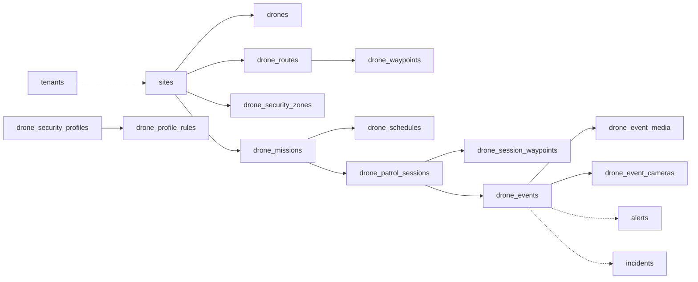
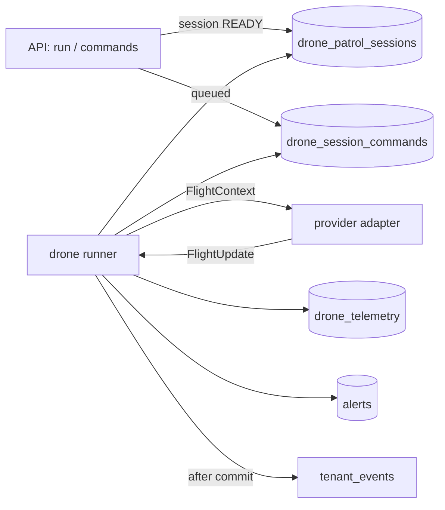

# Drone Patrol — Architecture

**As of:** 2026-10-04 · **All 14 phases built**, on the simulator: the data model
(migrations `0123`–`0130`), the API, flying, the site edge gateway, detection to
security event, CCTV correlation, incident response, the web screens, the phone,
reports, analytics, the security review and the final validation. 100 operations,
described in
`DRONE_PATROL_API.md`; running it is in `DRONE_PATROL_OPERATIONS.md`, the edge
gateway in `DRONE_PATROL_EDGE.md`, the AI in `DRONE_PATROL_AI.md`, adding a real
aircraft in `DRONE_PATROL_PROVIDER_INTEGRATION.md`.
This document describes what exists. Anything not yet built is listed at the end
and is not described as if it were. The analysis behind the design is
`DRONE_PATROL_GAP_ANALYSIS.md`.

## Principles

- **Additive only.** Every table is new and prefixed `drone_`. No existing table
  gained a column or changed a constraint. New tables point at existing rows
  (sites, cameras, users, alerts, incidents); existing tables know nothing about
  drones.
- **Invariants live in the database.** One flight per drone, one session per
  scheduled run, no duplicate telemetry, zones that are real shapes — each is a
  constraint, so no amount of retrying, restarting or racing can violate it.
- **History is copied, not referenced.** A session carries the names and a
  snapshot of the configuration it flew, so editing or deleting a mission, route
  or drone never rewrites what already happened.

## Data model

```mermaid
flowchart LR
  T[tenants] --> S[sites]
  S --> DR[drones]
  S --> RT[drone_routes] --> WP[drone_waypoints]
  S --> Z[drone_security_zones]
  P[drone_security_profiles] --> PR[drone_profile_rules]
  S --> M[drone_missions]
  M --> SC[drone_schedules]
  M --> PS[drone_patrol_sessions]
  PS --> SW[drone_session_waypoints]
  PS --> E[drone_events]
  E --> EM[drone_event_media]
  E --> EC[drone_event_cameras]
  E -.-> AL[alerts]
  E -.-> IN[incidents]
```

Dotted lines point at existing tables. Telemetry (`drone_telemetry`) belongs to
a drone and, while flying, a session; it is omitted above for clarity.

| Table | Holds | Key rule |
|---|---|---|
| `drone_module_licenses` | Whether a tenant has the module, until when, and its limits | One row per tenant. No row, disabled or expired = off |
| `drone_provider_configs` | Connection settings for a provider adapter | Secret stored encrypted, apart from `config` |
| `drone_edge_gateways` | A site's edge device | Only the SHA-256 of its credential is stored |
| `drones` | The fleet, with live health and position | `code` unique per tenant; `camera_id` is the camera row that carries its video (decision D1) |
| `drone_maintenance_logs` | Services, inspections, battery and firmware changes, faults | — |
| `drone_security_zones` | Map-space polygons, rectangles and circles | A circle needs a centre and radius; a polygon needs 3+ points |
| `drone_security_profiles`, `drone_profile_rules` | Reusable AI rule sets per module | One rule per module per profile |
| `drone_routes`, `drone_waypoints` | A base point and an ordered path | Sequence unique per route, deferrable so a route can be reordered in one transaction |
| `drone_missions` | Site + drone + route + profile | Unique name per tenant |
| `drone_schedules` | ONCE, DAILY, WEEKLY, SELECTED_DAYS, SPECIFIC_DATE, in a named timezone | SELECTED_DAYS needs days; SPECIFIC_DATE needs dates |
| `drone_patrol_sessions` | One row per execution | Unique `(schedule_id, scheduled_for)`; at most one in-flight session per drone |
| `drone_session_waypoints` | The route as flown, waypoint by waypoint | Copied at start |
| `drone_telemetry` | Position, altitude, heading, speed, battery, gimbal | Partitioned monthly; unique `(drone_id, recorded_at)` |
| `drone_events` | A detection after context: where, which zone, what risk | AI confidence (0–1) and risk score (0–100) are separate columns |
| `drone_event_media` | Snapshots and pre/event/post clips | Outside `evidence`, so outside the retention purge |
| `drone_event_cameras` | Fixed cameras correlated with an event | Camera name copied, so a deleted camera still reads |

## State vocabularies

**Drone status:** `OFFLINE`, `STANDBY`, `READY`, `PREPARING`, `MISSION_ACTIVE`,
`RETURNING`, `CHARGING`, `WARNING`, `COMMUNICATION_LOST`, `CRITICAL`,
`MAINTENANCE`, `DISABLED`. `DISABLED` is the soft delete: a drone with flight
history is disabled, not removed.

**Session status:** `SCHEDULED`, `PRECHECK`, `READY`, `LAUNCHING`, `ACTIVE`,
`PAUSED`, `EVENT_DETECTED`, `RETURNING`, `COMPLETED`, `FAILED`, `ABORTED`,
`CANCELLED`, `BLOCKED` (pre-flight refused), `MISSED` (never started within
grace). The seven from `PRECHECK` to `RETURNING` are "in flight"; a drone may have
at most one session in any of them.

**Event risk:** `INFO`, `LOW`, `MEDIUM`, `HIGH`, `CRITICAL`, with a 0–100 score
and a list of the factors that produced it. **Event location:** the drone's
position is recorded as fact; a projected object position, where one exists, is
marked `PROJECTED`.

## Idempotency

| Duplicate source | Stopped by |
|---|---|
| Scheduler restart, two workers, a retry | `uq_dps_execution (schedule_id, scheduled_for)` |
| Starting a drone that is already flying | `uq_dps_one_flight_per_drone` (partial, in-flight states) |
| A command pressed twice, or by two operators | `uq_dcmd_one_pending (session_id, command)` (partial, pending) |
| A gateway resending a flight update | `edge_seq` on the session: only a higher update number is applied |
| A gateway resending a whole batch | `uq_dsr_batch (gateway_id, batch_id)`: the stored answer is replayed |
| Reading a flight's detections again, or a sighting resent | `uq_dobs_detection`, `uq_dobs_client_ref` on `drone_observations` |
| Two runners, or a runner restart | Sessions and commands claimed `FOR UPDATE SKIP LOCKED`; flight state lives on the session |
| Edge resending a session, event or media file | `client_ref` unique on each |
| Edge resending a telemetry sample | `(drone_id, recorded_at)` unique |

## Tenant isolation

Every drone table (26) has `FORCE ROW LEVEL SECURITY` with the same policy text
as every other table in the system:
`tenant_id = current_setting('app.current_tenant', true)::uuid`.

Postgres does not pass a table's row security to its partitions, and a partition
can be selected from by name — so each telemetry partition carries the policy
itself. The platform's `apply_partition_rls()` puts it there: at migration (0130)
for the partitions that exist, and daily from the scheduler for the ones
pg_partman makes later. Until Phase 13 the drone migrations did not call it, and
the partitions they created were open by name until the scheduler's next run.

Deletion never blocks: every tenant foreign key cascades and every other foreign
key sets NULL.

## Permissions

| Permission | Admin | Manager | Supervisor | Operator | Guard | Viewer |
|---|:-:|:-:|:-:|:-:|:-:|:-:|
| `drone:read` | ✓ | ✓ | ✓ | ✓ | | ✓ |
| `drone:create` / `update` / `delete` | ✓ | ✓ | | | | |
| `drone:operate` | ✓ | ✓ | ✓ | ✓ | | |
| `drone:mission:create` / `update` | ✓ | ✓ | ✓ | | | |
| `drone:mission:execute` / `abort` | ✓ | ✓ | ✓ | ✓ | | |
| `drone:event:read` | ✓ | ✓ | ✓ | ✓ | ✓ | ✓ |
| `drone:event:acknowledge` / `investigate` | ✓ | ✓ | ✓ | ✓ | | |
| `drone:maintenance:read` | ✓ | ✓ | ✓ | | | |
| `drone:maintenance:manage` | ✓ | ✓ | | | | |
| `drone:report:read` | ✓ | ✓ | ✓ | ✓ | | ✓ |
| `drone:report:export` | ✓ | ✓ | ✓ | | | |

Super Admin and Client hold none: the platform owner licenses the module and
watches its health, and does not operate tenants' drones. Anyone who can start a
flight can abort it — a test enforces that.

## Licensing and billing

`drone_patrol` is listed in `billing_modules` (per site, priced at zero until a
price is set). A tenant has the module when its `drone_module_licenses` row is
enabled and unexpired. The entitlement deliberately does **not** live in
`tenant_module_licenses`; see the gap analysis §19.1.

## API layer

| Piece | Where | Does |
|---|---|---|
| Licence gate | `dependencies/drone_module.py` | Refuses creating, changing and flying without an enabled, unexpired `drone_module_licenses` row; counts limits under a per-tenant advisory lock so two requests cannot both take the last slot |
| Fleet | `routers/drones.py` | Drones, provider configs, edge gateways, maintenance, telemetry reads, dashboard, entitlement |
| Planning | `routers/drone_planning.py` | Zones, security profiles, routes and waypoints, missions, schedules |
| Operations | `routers/drone_operations.py` | Sessions, flight tracks, events and the decisions on them |
| Platform | `routers/platform_drone_licenses.py` | Super Admin grants the licence per tenant |
| Schedules | `services/drone_schedule.py` | Pure occurrence logic in the schedule's own timezone; used by the preview and by the drone runner |
| Geometry | `services/drone_geometry.py` | Zone shapes, point-in-zone, route length, off-site waypoints — on top of `geofence.py` |
| Provider catalogue | `services/drone_provider_registry.py` | Which providers exist and what their settings are; the simulator only |
| Shared | `services/drone_access.py` | Site visibility (404 outside), scoping clauses, audit |

Two rules shape every endpoint:

- **Reads and event decisions are never licence-gated.** A lapsed licence must not
  hide evidence or stop an operator closing an event raised before it lapsed.
- **Nothing is read after a commit.** The tenant setting is transaction-local, so
  a query after `commit()` runs with no tenant and fails. Every endpoint reads its
  response inside the transaction, then commits.

The only changes to existing files are registration: 11 added lines in `main.py`
(imports, `include_router` calls and tag descriptions), and the new
`drone-runner` service in `docker/docker-compose.yml`. Nothing existing changed.

## Flying (Phase 4)

```mermaid
flowchart LR
  API[API: run / commands] -->|session READY| S[(drone_patrol_sessions)]
  API -->|queued| C[(drone_session_commands)]
  R[drone runner] --> S
  R --> C
  R -->|FlightContext| P[provider adapter]
  P -->|FlightUpdate| R
  R --> TEL[(drone_telemetry)]
  R --> AL[(alerts)]
  R -->|after commit| BUS[tenant_events]
```

| Piece | Where | Does |
|---|---|---|
| Flight plan | `services/drone_flight_plan.py` | Pure: builds the plan from a route and its waypoints, the timeline of takeoff, legs, dwells and landing, the estimate (duration, distance, battery), and the frozen configuration snapshot |
| Providers | `services/drone_providers/` | The `DroneProvider` interface, declared capabilities, and the adapters. Only `simulator` exists |
| Simulator | `services/drone_providers/simulator.py` | Flies the plan in simulated time: battery drain, pause, return home, low-battery return at 20%, lost link, motor fault. Failures are chosen by hashing the session id, so every flight replays exactly |
| Pre-flight | `services/drone_preflight.py` | Pure: 18 blocking checks and 3 warnings, every one with a reason a person can act on |
| Sessions | `services/drone_sessions.py` | Loading a mission, creating a session with its snapshot, recording what a provider reports, raising alerts once |
| Runner | `services/drone_runner.py`, `drone_runner_main.py` | Carries out commands, launches ready sessions, flies live ones, creates scheduled sessions, polls drone health |

**The runner is its own process** (`drone-runner` in compose). The scheduler's
60-second loop also escalates man-down SOS; a slow drone provider must never
delay that, and an abort must be carried out in seconds, not at the next minute.

**A session flies its snapshot.** The plan comes from the configuration frozen
when the session was created, never the live tables, so editing a route while a
drone flies it changes nothing mid-air — and the launch-time pre-flight re-check
is against the frozen route too.

**Every provider call has a 10-second timeout.** A flight that has not been heard
from for 10 minutes is closed as `FAILED` and alerted, whatever the provider
thinks.

**Alerts go through the existing pipeline.** Drone alerts are rows in `alerts`
(module `drone_patrol`) announced as `alert_created` after the transaction
commits, so notification rules, push, webhooks and every alert screen handle them
unchanged, and nothing is announced that was then rolled back.

**Migration `0124`** adds `drone_session_commands`, five columns on
`drone_patrol_sessions` (`provider_state`, `last_tick_at`, `landed_at`,
`comms_lost_at`, `failure_code`), `drones.comms_alerted_at`, and
`drone_runner_tenants()` — a `SECURITY DEFINER` function that tells the runner
which tenants have work (licensed, flying, or with commands waiting) without the
runner bypassing row-level security. All drone-owned; nothing existing changed.

## The site edge gateway (Phase 5)

A drone registered with an edge gateway is flown **at its site**, by the
`drone-edge` service, with the provider adapter installed there — provider code
stays out of the central API. The session records its gateway when it is created;
the central runner then only watches over it.

| Piece | Where | Does |
|---|---|---|
| Wire format | `services/drone_edge_wire.py` | The batch, its bounds, and FlightUpdate to JSON and back — imported by both ends |
| Central side | `services/drone_edge_sync.py`, `routers/drone_edge.py` | Recognises a gateway by its credential under its tenant's RLS; applies its batch item by item in savepoints; hands it its work; accepts the files the policy asks for |
| The gateway | `drone_edge/agent.py`, `store.py`, `central.py`, `drone_edge_main.py` | Flies, buffers in a local SQLite outbox, syncs, claims, uploads; no database, no web framework |
| Watching over it | `services/drone_runner.py` | An unclaimed edge session is missed after 10 minutes; a silent one is failed after 60 as `EDGE_UNREACHABLE`; a silent gateway is marked `OFFLINE` with one alert |

**Shared rules.** Pre-flight before launch, recording a flight update, health,
closing a command and ending a session are the same functions whether the central
runner or a gateway flew the drone (`drone_sessions.recheck_before_launch`,
`record_update`, `apply_health`, `finish_command`, `end_session`), so where a drone
was flown from never changes its record.

**A late record corrects a guess.** A flight the runner closed as
`EDGE_UNREACHABLE` is replaced by the gateway's own record when it reconnects. No
other ended session is reopened.

**Migration `0125`** adds `drone_sync_receipts`, the gateway's reported health on
`drone_edge_gateways`, `edge_seq` and `edge_claimed_at` on sessions,
`delivered_at` on commands and `edge_gateway_id` on media, and widens
`drone_runner_tenants()` to tenants with a gateway that has not gone offline.
Drone-owned only.

The two changes outside the drone module are registration again: the edge router
in `main.py` (3 lines) and the opt-in `drone-edge` compose service with its volume.

## AI: detection to security event (Phase 6)

The AI workers are not changed: a drone's camera is a camera, and its detections
are ordinary `detections` rows. The drone runner's AI job reads each flying
drone's new detections (with the module's own row — plate, watchlist verdict —
and the worker's own alert, if any), and `drone_ai_pipeline.observe()` takes each
through context, grouping, risk, verification and alerting. A sighting from a
site edge gateway enters the same function. The rules themselves are pure
(`drone_ai.py`).

Every detection that feeds an event is kept in `drone_observations`, unique on
`detection_id` and on the gateway's `client_ref`, so re-reading is harmless and
an event shows what it rests on. Alerts go into the existing `alerts` table as
`drone.<module>`; a worker's alert that is already as serious is linked instead,
never repeated. The workers still alert on their own — a decision for the owner,
in `DRONE_PATROL_AI.md`.

**Migration `0126`** adds `drone_observations`, grouping and verification columns
on `drone_events` (`label`, `last_detected_at`, `detection_count`, `attributes`,
`verified_at`, `risk_evaluated_at`, `source`) and `drone_patrol_sessions.
ai_watermark_at`. Drone-owned only.

## CCTV correlation (Phase 7)

For each drone event the runner's AI job finds the site's fixed cameras that
could have seen the spot (`drone_cctv.py`, pure) and, per camera, what it detected,
alerted and recorded in the event's window (`drone_cctv_correlation.py`), writing
one `drone_event_cameras` row per camera. A fixed camera whose own detection
matches the drone's corroborates the event: `drone_ai_pipeline.reassess()` scores
it again, and a second sensor agreeing verifies it.

**Migration `0127`** adds `drone_camera_coverage` (optional surveyed coverage,
decision D2), correlation columns on `drone_event_cameras` (bearing, coverage,
corroboration, the related detection, the recording and offset, online) and
`cctv_correlated_at` / `cctv_final` on `drone_events`. Drone-owned only;
`cameras`, `streams`, `recordings`, `detections` and `alerts` are only read.

## Incident response (Phase 8)

`services/drone_response.py` takes a drone event the rest of the way:
**incident** (a row in the platform's `incidents`, with `incident_notes` and
`incident_status_history` — no parallel incident system), **guard** (on shift at
the site, free, nearest by last known position, dispatched through the existing
`dispatch_guard`), **resolution** (an incident resolved or closed resolves its
drone event) and **verify with drone** (an officer's request, checked against the
flight and queued as an ordinary pause and resume).

The pipeline calls `on_assessed()` after every assessment, so an incident opens
the moment the rules call for one and its severity follows the event's risk.
The drone alert's realtime payload carries the command-centre card.

Two facts about the existing incident system shape this, and are left as they
are: incidents have **no site column** — they take their site from their camera,
so a drone incident is linked to the drone's camera; and they have **no number**
— the drone module gives each a display reference in `message_params`.

**Migration `0128`** adds `drone_verification_requests` (one active per flight).
Drone-owned only; incidents, notes, status history and dispatch are used through
their own tables and functions.

## Screens (Phase 9)

Eight routes in the existing web app, built from its own parts — `GlassCard`,
`PageHeader`, the MUI theme, the map tiles the Site Map uses (`VITE_MAP_TILE_URL`),
the Live Wall's `HlsPlayer` and the realtime store — so they look and behave like
the Command Center rather than a separate product.

| Route | Screen | What it does |
|---|---|---|
| `/drones` | Drone dashboard | Fleet KPIs; drones with health, battery and heartbeat; providers from the catalogue; edge gateways (credential shown once); a drone's camera link |
| `/drone-missions` | Missions | Each mission's drone, route, profile, schedules, last and next run; enable; run now |
| `/drone-missions/new`, `/:id` | Mission designer | Route drawn on the map (click to add, drag to move, launch point), waypoint hover/observe/snapshot, zones overlaid, AI profile, recording policy, battery floor, schedules in the site's zone, pre-flight with every failing check and the estimate |
| `/drone-zones` | Zones & AI profiles | Zones drawn as polygon, rectangle or circle with type, severity, alert policy, hours, days, allowed plates; profiles as a module-by-module table |
| `/drone-patrols` | Patrols & reports | Every flight, filtered by site, drone, status and dates; period totals; CSV export (`drone:report:export`) |
| `/drone-patrols/:id` | Live mission / replay | While it flies: the drone camera's live video, position, telemetry, waypoint progress, events, and pause / resume / return home / abort / cancel. After: the flown track on a timeline, events marked, telemetry at any moment |
| `/drone-events` | Events | Open events first; risk and AI confidence always shown as two numbers |
| `/drone-events/:id` | Investigation | Snapshots and clips, the spot on the map, the risk factors, detections, fixed cameras (live or the recording at the event), the incident and its guard; acknowledge, investigate, escalate, open incident, dispatch a guard, verify with drone, resolve, false positive |

Each action is shown only to a role that may take it; the API still decides.
Screens refresh on the drone realtime announcements and poll as a fallback.
Drone media is fetched with the session's token and shown from memory, because
the media endpoint takes the token in a header, not the URL.

Registration touched three existing frontend files, additively: `App.tsx` (the
routes), `Sidebar.tsx` (a "Drone Patrol" section) and `hooks/usePermission.ts`
(the drone codes in the fallback matrix, mirroring migration `0123`'s grants).
The paths are flat (`/drone-events`, not `/drones/events`) because the sidebar
highlights by prefix.

## Phone and desktop (Phase 10)

**The phone** carries the response, not the planning: a route is not drawn with a
thumb. Added to the existing Expo app, in its own patterns (`Card`, the theme,
react-query, the realtime hook, the permission gate in `lib/access.ts`):

| Where | What |
|---|---|
| More → Drone Events (`drone:event:read`) | Open events first; risk and AI confidence labelled apart on every row; refreshes on the drone announcements |
| Drone Event | Snapshot (tap to enlarge) and clip, details in site time, the risk factors, coordinates with **Open in Maps**, the incident and its guard; **Acknowledge**, **Escalate**, **Open Incident**, **Dispatch Guard** (free guards nearest first, or "nearest available"), **Resolve**, **False Positive** (needs a reason) — each shown only to a role that may take it |
| Alerts → a drone alert | **View the drone event**, found by `GET /drone-events?alert_id=` |
| Incidents | Unchanged: a drone incident is a platform incident, so its status, notes and the guard's acknowledge-arrive-resolve flow are the existing screens; the event links to it |

Drone alerts need nothing new to arrive: they are `alerts` rows announced as
`alert_created`, so the existing push (sent for high and critical alerts), the
Alerts tab and its new "Drone" filter chip already carry them. Snapshots load as images with the session token in a
header. The app has no video player, so a clip plays in a web view that fetches
the file with the same header and plays it from memory — the media endpoint's
authentication is unchanged.

Registration touched four existing mobile files, additively: the navigator (three
screens), the More menu (one row), the alert detail screen (the link, on drone
alerts only) and the Alerts module filter (one chip).

**The desktop app** is the web build in an Electron shell with no API layer of its
own, so it has every Phase 9 screen once rebuilt (`npm run dist` in `desktop/`):
drone alerts and their native notifications, the live drone view, CCTV
correlation, mission status, the incident workflow and replay. Nothing
drone-specific was added to it. Its content policy already allows what the
screens load — https map tiles, in-memory images and video, the API and its
websocket — and a repository test now holds it to that.

## Reports (Phase 11)

`services/drone_reports.py` loads a flight into one dictionary — mission, route,
AI summary, events — and renders it three ways: the JSON endpoint, the PDF
(reportlab) and the workbook (openpyxl). One loader, so a number cannot differ
between them. It reads the session's frozen configuration, never the live
tables; an event's picture is the file recorded with it (the gateway's upload,
else the AI worker's own evidence, read only), never a fresh frame. The route is
drawn from the waypoints and the telemetry, to scale, with no map tiles — the
report builds with no network.

`services/drone_report_delivery.py` decides who is sent what. A recipient covers
the organisation, a site or a mission, at one of four frequencies. A flight that
ended five minutes ago has its PDF and workbook written to the evidence store and
recorded in `drone_reports` with their SHA-256, and — if anyone subscribed to
"immediately" covers it — one row queued. A closed day, week or month with
flights in it queues one summary per scope, computed in the organisation's zone.
The queue is Virtual Patrolling's discipline, with its backoff and period
arithmetic imported: claimed in a committed transaction before sending, built at
send time, retried further apart each time, left `FAILED` with its reason after
five attempts. Unique indexes make queueing idempotent.

The runner's report job runs every 60 s **beside** the flight loop as its own
task, never in it: a PDF or a slow mail server cannot delay a command. It visits
the tenants `drone_report_tenants()` names, which — unlike the runner's usual
list — includes a tenant whose licence lapsed while a report was still owed.
Mail goes through the platform's SMTP settings.

**Migration `0129`** adds `drone_reports`, `drone_report_recipients`,
`drone_report_email_queue`, `drone_patrol_sessions.report_queued_at` and
`drone_report_tenants()`. Drone-owned only; `evidence` is read, nothing else of
the platform's is touched. Registration: the router and its tag in `main.py`, one
environment line on the `drone-runner` service.

The web's **Patrols & reports** screen gained three tabs — Summary, Report
recipients, Email deliveries — and a finished flight offers **Report PDF** and
**Excel**.

## Analytics (Phase 12)

`services/drone_analytics.py` answers three questions from the rows already
recorded — nothing is stored, modelled or trained, and the same rows always give
the same answer.

- **How are the patrols going?** Flights and mission success, events and their
  trend by day, suspicious events by hour and weekday, detection types, each
  mission and drone, the false-positive rate and the incident conversion rate.
  Hours and days are the organisation's own.
- **Where are the drones finding things?** Each area's events, weighted by how
  serious each was assessed to be, per week: an analytical score with a level.
  Hot spots are events gridded to about 28 m; repeated intrusion locations are
  the cells where intrusion keeps being seen. A false positive weighs nothing —
  a place is not risky because the AI was wrong there.
- **What might be worth doing?** Six fixed rules over those same aggregates, each
  producing a suggestion with the observation and the numbers it rests on.

The score and the suggestions are labelled as what they are wherever they appear:
the score is not a prediction, and a suggestion is not a conclusion. Both labels
travel in the API response itself, so a client cannot show one without having the
other to hand.

Aggregation is in SQL over the existing time and site indexes, bounded to a year;
no migration was needed. The web's **Drone Analytics** screen draws it with the
app's own layout boxes — stat tiles, single-hue bars, separate small charts
rather than a second axis, the risk map on the site map — and no chart library.
Registration: the router and its tag in `main.py`; a route, a tab and a sidebar
entry in the web app.

## Security review (Phase 13)

The finished module, checked against the platform's own rules. Each property is
pinned by a test that walks the application's route table rather than a list
kept in the test, so an operation added later is covered — or fails — without
anyone remembering it (`tests/test_drone_security.py`).

| Property | How it holds | What the review changed |
|---|---|---|
| Tenant isolation | Row level security on every table and every partition; each request is scoped to the caller's tenant | Telemetry partitions had no policy of their own — fixed in migration 0130 |
| Permissions | All 100 operations require a permission (97) or a gateway credential (3); nothing that changes data sits behind a read permission; a user with no drone permission is refused by every one | Nothing — verified |
| Not found, not forbidden | Another tenant's ids answer 404 from all 66 id-addressed operations; another site's answer 404 to a supervisor of a different site; nothing of theirs is changed by the attempt | Nothing — verified |
| Secrets | Provider secrets are write-only and encrypted; a gateway credential is stored as a hash; a camera's stream address never leaves the server | Nothing — verified across every GET and the gateway's sync answer |
| Audit | Every operation that changes something writes to the hash-chained audit log | Evidence handed over (`drone.media.access`) and reports taken out (`drone.report.export`, with the document's SHA-256) left no trace — now they do |
| Gateway sync | Credential compared in constant time with one identical refusal; every item tied to the gateway that sent it; a file accepted only if it is exactly the file described | A file's `telemetry_snapshot` had no size bound — now 8 KB |
| Errors | An unexpected failure answers a bare 500 and is recorded for the platform owner | A failed report email stored the raw exception text where the organisation could read it — now only a mail server's own refusal is shown |
| Rate limits | Gateway endpoints per address; report exports per person | Exports were unlimited — now 30 a minute per person across the three |
| Platform health | The runner writes a heartbeat; the console counts across tenants through `platform_drone_health()` | The platform owner's console had no drone row — now it has one |
| Performance | Period queries walk time indexes; lists page | Two indexes added from measurement; a year of a large fleet timed (gap analysis §24.7) |

**The health row** (`services/drone_platform_health.py`) asks two things of two
sources, because neither can answer both. Redis says whether the runner is alive
— it writes `drone_runner:heartbeat` on every pass, with a 60-second expiry, so a
stopped runner cannot leave a stale "alive" behind. The database says whether it
is keeping up — flights in the air, commands owed for over a minute, report
emails more than fifteen minutes late, counted across all tenants by a
`SECURITY DEFINER` function that returns counts only. An installation where
nobody is licensed and nothing is owed reads `ok` without a runner.

**The export limit** is counted per signed-in person, not per address: an office
behind one address is many people. It is counted inside the operation, after the
permission check has verified the token.

Two findings belong to the platform rather than the module and were reported,
not changed: the scheduler's nightly partition maintenance is failing, and the
platform-wide default rate limit is not being applied (gap analysis §24.6).

## A flight's distance

`drone_patrol_sessions.distance_m` is the length of the flight's recorded track
over the ground. It grows as positions arrive — only samples later than the last
one stored count, so a resent or out-of-order sample is never added twice — and
is taken again from the whole stored track when the flight ends, which is the
figure reports and analytics use. A flight that never left the ground has none.

## Not built

No real drone, manufacturer SDK or edge hardware is connected, and none is
claimed: every flight so far is the simulator's, and no real video has passed
through the module. What a real aircraft needs is in
`DRONE_PATROL_PROVIDER_INTEGRATION.md` and summarised in
`DRONE_PATROL_IMPLEMENTATION.md`. How long drone footage and telemetry are kept
is an open decision (gap analysis §24.8), and the desktop release that would
carry the drone screens has not been made (§25.6).
