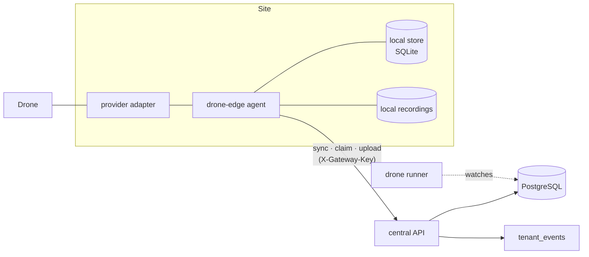

# Drone Patrol — Site Edge Gateway

**As of:** 2026-09-25 · **Phase 5.** The gateway software, the central API it
talks to, and the rules for outages, duplicates and recordings are built and
tested — against the simulator. No site edge hardware or real drone has been
connected.

## What it is

A **site edge gateway** is a small service that runs **at a site**, next to its
drones. It flies them with the provider adapter installed there, keeps flying and
recording when the link to the central server drops, and catches the centre up
when the link returns. Provider code never runs in the central API.



| Piece | Where |
|---|---|
| The gateway service | `backend/app/drone_edge/` (`agent.py`, `store.py`, `central.py`), entry point `app.drone_edge_main` |
| What the two sides say to each other | `backend/app/services/drone_edge_wire.py` — imported by both |
| The central side | `backend/app/services/drone_edge_sync.py`, `backend/app/routers/drone_edge.py` |
| Watching over edge flights | `backend/app/services/drone_runner.py` (`watch_edge_sessions`, the gateway sweep) |
| Schema | migration `0125` |

The gateway has **no database connection and no web framework**: it needs its
credential, the central address, a disk, and the provider adapter for its drones.

## Who flies which drone

A drone registered with an `edge_gateway_id` is flown by that gateway. A session
records its gateway when it is created, and the central drone runner leaves it
alone from then on — moving a drone to another gateway mid-flight does not move
the flight.

| | Central drone | Edge drone |
|---|---|---|
| Session created by | the API (manual run) or the runner (schedule) | same |
| Pre-flight before launch | runner, just before launching | centre, when the gateway **claims** the session |
| Flown by | central runner | the gateway |
| Health (heartbeat) | runner polls the provider | gateway polls, reports in its sync |
| Commands | runner carries them out | gateway collects them and reports the outcome |
| Silence judged by | the runner: 10 min → `FAILED` | the runner: 60 min → `FAILED` / `EDGE_UNREACHABLE`, **corrected** if the gateway later reports the real flight |

## One cycle, every two seconds

1. **Fly.** For each flight it has claimed: carry out waiting operator commands
   first, then take the provider's next update. Both are written to the local store
   before anything is sent.
2. **Health.** Every 15 s, ask each idle drone for its health.
3. **Sync.** Send the oldest waiting items as one batch
   (`POST /api/v1/drone-edge/sync`). The answer says what was accepted, what was
   refused and why, and what to do now: its drones, sessions it may claim,
   commands for its flights, files the centre wants.
4. **Claim.** A ready session for one of its drones is claimed
   (`POST …/sessions/{id}/claim`) — which re-runs pre-flight centrally with the
   gateway's latest health — and launched at once.
5. **Upload.** Files the centre asked for (`PUT …/media/{client_ref}`), within the
   site's bandwidth limit.

## When the link drops

- **Flights in the air keep flying**, every update and sample is kept, and events
  and files recorded meanwhile are kept.
- **No new flight starts.** The licence, pre-flight and the operators' commands
  live centrally; a gateway that cannot reach them does not launch on its own
  authority. A scheduled run that falls due during an outage is recorded
  **missed** if the gateway does not claim it within 10 minutes. *(See "Decision
  for the owner" below.)*
- **The centre notices.** After the gateway's heartbeat timeout (default 90 s) it
  is marked `OFFLINE` and **one** `drone.gateway_offline` alert is raised for the
  site — not one per drone behind it. Its drones are marked
  `COMMUNICATION_LOST`, without alerts of their own.
- **After an hour** of silence about a flight, the runner closes it as
  `FAILED` / `EDGE_UNREACHABLE` and alerts, so the drone is not locked forever
  and a person goes to look.

When the link returns, the gateway sends everything, oldest first — **once**:

| Could be duplicated by | Prevented by |
|---|---|
| A resent flight update | each update is numbered per session; the centre applies only a higher number (`edge_seq`) |
| A resent batch whose answer was lost | the gateway resends the same batch id and items; the centre replays the stored answer (`drone_sync_receipts`) |
| A resent telemetry sample | unique `(drone_id, recorded_at)` |
| A resent event or file description | the gateway's own `client_ref`, unique |
| A command reported twice | a command is closed once |

A flight the centre had closed as `EDGE_UNREACHABLE` is **corrected** by the
gateway's record: waypoints, telemetry and the real outcome replace the guess.
No other ended session is ever reopened.

**One bad item never blocks the rest.** Each item is applied in its own savepoint;
one the database refuses is rejected with a reason and the batch carries on. If a
whole batch is refused as malformed, the gateway sends items one at a time until
it finds the bad one, sets it aside in its local `rejected` table with the reason,
and carries on.

**A restart loses nothing.** Recording an update and queueing it for the centre is
one local transaction; a restarted gateway resumes the flight from the provider
state it stored. If it crashed between claiming a session and recording the
launch, the centre's answer still lists the session as claimed and the gateway
adopts it.

## Recordings

The gateway keeps every file it records. Whether the **centre** gets a copy
follows the site's existing recording policy (`recording_policies`, migration
0079), overridden per mission by `drone_missions.recording_sync_mode`:

| Sync mode | Event media (snapshot, pre/event/post clips) | Full flight recording |
|---|---|---|
| none set (default) | uploaded | stays at site |
| `central` | uploaded | uploaded |
| `incident_only` | uploaded | stays at site |
| `scheduled` | uploaded, only inside the site's sync window | stays at site |
| `local_only`, `manual` | stays at site | stays at site |

The default is the brief's: *full drone recording remains at site; important events
are synchronised centrally.* The centre decides and tells the gateway, file by file.
Uploads are accepted only if they are exactly the file described (size, SHA-256,
JPEG/PNG or MP4). A file the policy keeps at the site is refused if sent anyway.
An investigator asking for a file that was never uploaded is told where it is
(409, naming the gateway), not given a broken link.

Event clip lengths come from the site's policy (`clip_pre_seconds`,
`clip_post_seconds`; 20 s and 60 s when the site has none) and are handed to the
gateway in its assignment. Local files are pruned after `local_retention_days` —
only once the centre has them or has said it does not want them. With no local
retention set, nothing is pruned.

**What recording needs from the aircraft.** The gateway stores whatever the
provider can produce: a snapshot at each waypoint marked `snapshot_required` if
the provider has the `SNAPSHOT` capability, and events and files reported to it
(`report_event`, `record_media`) by edge AI or a recorder. The simulator has no
camera, so it records no media, and none is invented for it.

## Security

- **Its own credential.** Issued once when the gateway is registered, stored only
  as a SHA-256 hash, rotated with `POST …/edge-gateways/{id}/rotate-credential`
  (the old one stops at once). It names its tenant, so every lookup runs under that
  tenant's row-level security. No `SECURITY DEFINER`, no cross-tenant query.
- **Nothing else is accepted, and it is accepted nowhere else.** A user's token
  cannot call the edge API; a gateway credential cannot call anything else. Wrong
  secret, wrong tenant, malformed key: one identical 401. A disabled gateway: 403.
- **Scoped to its own site's work.** A gateway can claim, report on and upload for
  only its own sessions and drones; anything else is refused per item.
- **No secrets travel.** Provider credentials are installed on the gateway
  (`DRONE_EDGE_PROVIDER_SECRETS`); the centre never sends them.
- **Rate limited** per address (sync 600/min, claim 120/min, upload 300/min).
- **Sync is not licence-gated**, so a lapsed licence never throws away what a
  gateway recorded or strands a drone; claiming a new flight is, through
  pre-flight.
- The tenant's **IP allowlist** (for people signing in) does not apply to
  gateways, as it does not to alarm panels.

## Running one

Register the gateway (`POST /api/v1/drones/edge-gateways`), copy the credential it
shows once, and point the drones at it (`edge_gateway_id`). Then, at the site:

```bash
docker compose --profile drone-edge up -d drone-edge
```

| Variable | Default | |
|---|---|---|
| `DRONE_EDGE_KEY` | — | the credential (required) |
| `DRONE_EDGE_CENTRAL_URL` | `http://api:8000` | the central API |
| `DRONE_EDGE_DATA_DIR` | `/data/drone-edge` | local store and recordings |
| `DRONE_EDGE_PROVIDER_SECRETS` / `…_FILE` | none | `{provider_config_id: {field: value}}` |
| `DRONE_EDGE_TICK_SECONDS` | 2 | |
| `DRONE_EDGE_HEALTH_SECONDS` | 15 | |

In this repository it is a compose service under the `drone-edge` profile, so it
never starts with the core stack.

**Watching it:** `GET /api/v1/drones/edge-gateways` shows status, last seen, last
sync, backlog, free storage and clock offset. A gateway is `DEGRADED` when its
clock is more than 30 s out (every time it reports would be wrong), its backlog is
more than 5 minutes old, or it has under 10% storage free — and it says which.
`GET …/edge-gateways/{id}/sync-receipts` lists the last week of batches and every
item refused, with the reason.

## Decision for the owner

**Should a gateway start scheduled patrols on its own while the link is down?**
Built now: no — it finishes flights already in the air but launches nothing new
without the centre. The alternative is for the gateway to hold its drones'
schedules and launch due runs offline, judging pre-flight locally, with the centre
reconciling the sessions afterwards. That keeps patrols going through an outage,
at the price of launching without a current licence check and without operators
able to cancel. Not built until you choose it.

## Not built yet

- Uploading a `manual`-policy file on request (with the media screens, phase 9).
- Edge AI — the gateway takes sightings and files through `report_event` /
  `record_media`, and from Phase 6 every sighting goes through the same context,
  risk and verification as a central detection (`DRONE_PATROL_AI.md`); nothing at
  the site produces sightings yet.
- Event clip cutting from a continuous local recording — it needs a provider that
  records, which the simulator does not.
- Anything on real site hardware.
