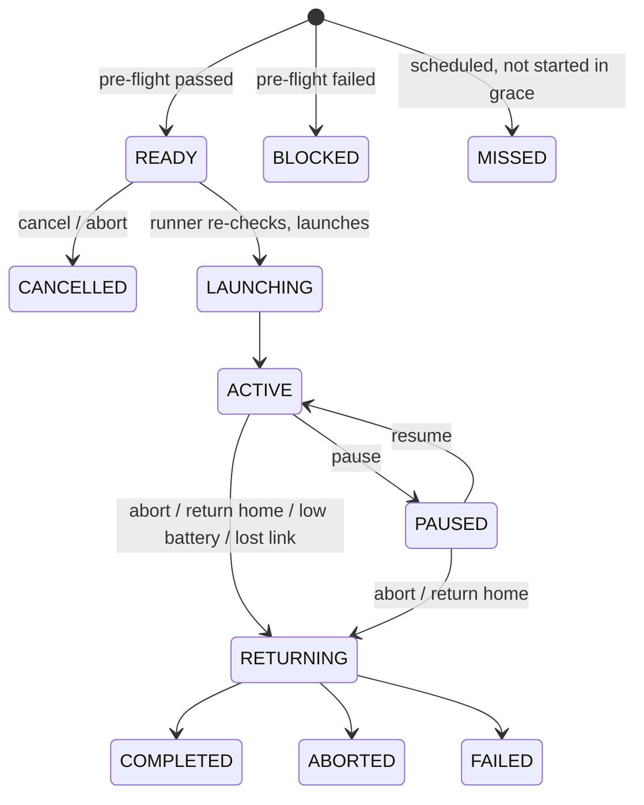

# Drone Patrol — Operations

**As of:** 2026-09-25 · Covers Phases 4–5: the drone runner, the flight lifecycle,
commands, alerts, site edge gateways and what to do when something goes wrong.
Only the simulator provider exists; every flight described here is simulated until
hardware is connected. The edge gateway itself is described in
`DRONE_PATROL_EDGE.md`.

## The drone runner

A worker process of its own (`drone-runner` in `docker/docker-compose.yml`, entry
point `app.drone_runner_main`), built from the backend image like the scheduler.
It is separate so that a slow provider can never delay the scheduler's man-down
escalation, and so an abort is carried out in seconds rather than at the
scheduler's once-a-minute tick.

| Job | Default cadence | Environment variable |
|---|---|---|
| Commands, launches and live flights | every 2 s | `DRONE_RUNNER_TICK_SECONDS` |
| Drone health polls, then the lost-link sweep | every 15 s | `DRONE_RUNNER_HEALTH_SECONDS` |
| Sessions owed by schedules | every 30 s | `DRONE_RUNNER_SCHEDULE_SECONDS` |

```bash
docker compose -f docker/docker-compose.yml up -d drone-runner
```

On the 7.7 GB development machine it is light (no ML imports), but it is not one
of the core seven services — start it when working on drones. It logs only when
something happens: commands carried out, sessions created, drones lost or
recovered.

It is safe to run more than one: sessions and commands are locked with
`SKIP LOCKED`, so two runners never fly the same session. It is safe to restart:
flight state lives on the session, and a flight resumes where it was.

**Drones behind a site edge gateway are not flown by the runner.** Their gateway
claims and flies their sessions and collects their commands. The runner only
watches: an edge session nobody claims within 10 minutes is recorded `MISSED`
(`EDGE_NOT_CLAIMED`); one whose gateway is silent for 60 minutes is closed
`FAILED` (`EDGE_UNREACHABLE`) — corrected if the gateway later reports the real
flight. Its health tick also marks a silent gateway `OFFLINE` and deletes sync
receipts older than a week.

## A flight, start to finish



- **Manual run** — `POST /drone-missions/{id}/run`. Pre-flight runs at once; the
  session is `READY` or `BLOCKED` with every reason.
- **Scheduled run** — the runner creates the session when it is due, judged by
  pre-flight at that moment. A run from before the schedule or its mission was last
  changed is never owed. A run the runner could not start within the schedule's
  grace period is recorded `MISSED`.
- **Launch** — the runner re-checks pre-flight with the freshest health against
  the session's **frozen** route, then launches. A drone can be in at most one
  flight; the database enforces it.
- **Outcome** — `COMPLETED` (every waypoint patrolled), `ABORTED` (an operator
  ended it) or `FAILED` (it could not finish). A fault after every waypoint was
  patrolled still ends `COMPLETED`, with the fault recorded and alerted.

## Commands

`pause`, `resume` (`drone:operate`), `abort`, `return-to-home`, `cancel`
(`drone:mission:abort`) on `/drone-patrols/{id}/…`. Each is queued and carried out
by the runner within about two seconds; `GET /drone-patrols/{id}/commands` shows
who asked, when, and what happened.

- Commands are refused at once when the session's state doesn't allow them, or
  the drone's provider can't do them.
- Before launch, abort and return-to-home simply cancel.
- Pressing the same command twice — or two operators at once — is one command.
- **Flight commands are never licence-gated.** A licence that lapses mid-flight
  cannot stop anyone bringing a drone down; only starting a new flight is gated.

## Alerts it raises

All go into the existing `alerts` table as module `drone_patrol` and are announced
as ordinary `alert_created` events, so notification rules, push, webhooks and
every alert feed handle them with no change. Each is raised once per flight (or
once per outage).

| Code | Severity | When |
|---|---|---|
| `drone.preflight_blocked` | medium | A scheduled run, or a ready run re-checked at launch, fails pre-flight |
| `drone.mission_missed` | medium | A scheduled run was not started within its grace period |
| `drone.comms_lost` | high | A flight reports a lost link, or an idle drone goes silent past its heartbeat timeout |
| `drone.mission_failed` | high | A flight ends `FAILED`, cannot launch, or has been out of contact for 10 minutes |
| `drone.flight_fault` | medium | A flight completed its patrol but reported a fault |
| `drone.command_failed` | **critical** | An abort or return-to-home could not be delivered — take manual control |
| `drone.gateway_offline` | high | A site edge gateway was silent past its heartbeat timeout. One per outage, for the site — its drones are not alerted one by one |

Realtime events for screens, on `tenant_events:<tenant>`: `drone_session_updated`,
`drone_telemetry` (latest position each tick), `drone_status_changed`,
`drone_command_processed`, and from edge gateways `drone_gateway_status_changed`,
`drone_sync_completed`, `drone_event_created`, `drone_media_recorded`,
`drone_media_synced`.

## When something goes wrong

| Symptom | Likely cause | Do |
|---|---|---|
| Mission `BLOCKED` | A pre-flight check failed | Read `blocked_reason` or `preflight_result`; every failing check is listed. `GET /drone-missions/{id}/preflight` re-checks without creating anything |
| Drone `COMMUNICATION_LOST` | No heartbeat within `heartbeat_timeout_seconds` | Check the aircraft's power and link. It recovers by itself the next time it answers |
| Scheduled runs never appear | The runner isn't running, or the tenant's licence has lapsed | `docker compose ps drone-runner`; `GET /drones/entitlement` |
| Session stuck `ACTIVE` | The provider stopped answering | It closes itself as `FAILED` after 10 minutes of silence, and alerts |
| `drone.command_failed` | The abort or return-to-home didn't reach the drone | Use the manufacturer's own controller. The command's `result` has the provider's error |
| `drone.gateway_offline` | The site's link, power or gateway host is down | Flights in the air continue under the gateway and catch up when it returns. Check the site's network and the `drone-edge` service |
| Gateway `DEGRADED` | Clock more than 30 s out, backlog older than 5 min, or under 10% storage | `health.problems` on the gateway says which. Fix the clock (NTP) first — every time it reports depends on it |
| Edge session `MISSED` / `EDGE_NOT_CLAIMED` | The gateway was offline, or its drone was busy, when the run was due | Gateways do not start new flights without the centre. Check the gateway, then run the mission again |
| Items refused in a sync | Something the gateway sent can never be accepted | `GET /drones/edge-gateways/{id}/sync-receipts` lists each with the reason; the gateway keeps them in its local `rejected` table |

## Simulator settings

The simulator provider takes `speed_factor` (1 = real time; 10 flies a 10-minute
route in 1 minute) and `failure_rate` (0–1: the share of flights that fail on
purpose). Which flights fail, how and when is decided by the session id, so a
failure can be replayed exactly.
