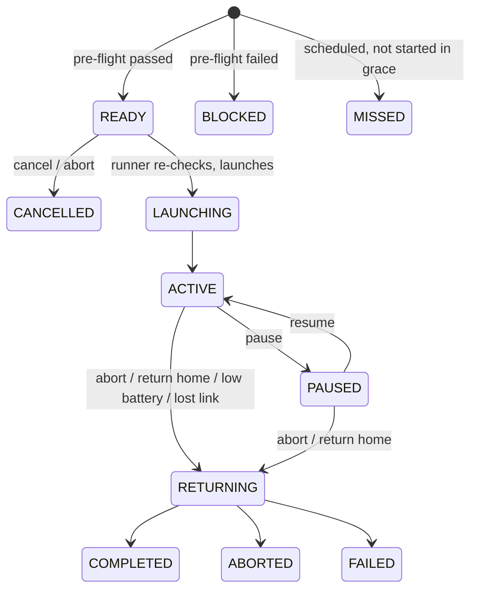

# Drone Patrol — Operations

**As of:** 2026-09-25 · Covers Phases 4–5: the drone runner, the flight lifecycle,
commands, alerts, site edge gateways and what to do when something goes wrong.
Only the simulator provider exists; every flight described here is simulated until
hardware is connected. The edge gateway itself is described in
`DRONE_PATROL_EDGE.md`.

## The drone runner

A worker process of its own (`drone-runner` in `docker/docker-compose.yml`, entry
point `app.drone_runner_main`), built from the backend image like the scheduler.
It is separate so that a slow provider can never delay the scheduler's man-down
escalation, and so an abort is carried out in seconds rather than at the
scheduler's once-a-minute tick.

| Job | Default cadence | Environment variable |
|---|---|---|
| Commands, launches and live flights | every 2 s | `DRONE_RUNNER_TICK_SECONDS` |
| Drone health polls, then the lost-link sweep | every 15 s | `DRONE_RUNNER_HEALTH_SECONDS` |
| Sessions owed by schedules | every 30 s | `DRONE_RUNNER_SCHEDULE_SECONDS` |
| Flights' new AI detections into drone events; closing unconfirmed sightings; CCTV correlation | every 3 s | `DRONE_RUNNER_AI_SECONDS` |
| Finished flights' reports stored; report emails queued and sent | every 60 s, beside the loop | `DRONE_RUNNER_REPORT_SECONDS` |

```bash
docker compose -f docker/docker-compose.yml up -d drone-runner
```

On the 7.7 GB development machine it is light (no ML imports), but it is not one
of the core seven services — start it when working on drones. It logs only when
something happens: commands carried out, sessions created, drones lost or
recovered.

It is safe to run more than one: sessions and commands are locked with
`SKIP LOCKED`, so two runners never fly the same session. It is safe to restart:
flight state lives on the session, and a flight resumes where it was.

**Drones behind a site edge gateway are not flown by the runner.** Their gateway
claims and flies their sessions and collects their commands. The runner only
watches: an edge session nobody claims within 10 minutes is recorded `MISSED`
(`EDGE_NOT_CLAIMED`); one whose gateway is silent for 60 minutes is closed
`FAILED` (`EDGE_UNREACHABLE`) — corrected if the gateway later reports the real
flight. Its health tick also marks a silent gateway `OFFLINE` and deletes sync
receipts older than a week.

## A flight, start to finish


```mermaid
stateDiagram-v2
    [*] --> READY: pre-flight passed
    [*] --> BLOCKED: pre-flight failed
    [*] --> MISSED: scheduled, not started in grace
    READY --> CANCELLED: cancel / abort
    READY --> LAUNCHING: runner re-checks, launches
    LAUNCHING --> ACTIVE
    ACTIVE --> PAUSED: pause
    PAUSED --> ACTIVE: resume
    ACTIVE --> RETURNING: abort / return home / low battery / lost link
    PAUSED --> RETURNING: abort / return home
    RETURNING --> COMPLETED
    RETURNING --> ABORTED
    RETURNING --> FAILED
```

- **Manual run** — `POST /drone-missions/{id}/run`. Pre-flight runs at once; the
  session is `READY` or `BLOCKED` with every reason.
- **Scheduled run** — the runner creates the session when it is due, judged by
  pre-flight at that moment. A run from before the schedule or its mission was last
  changed is never owed. A run the runner could not start within the schedule's
  grace period is recorded `MISSED`.
- **Launch** — the runner re-checks pre-flight with the freshest health against
  the session's **frozen** route, then launches. A drone can be in at most one
  flight; the database enforces it.
- **Outcome** — `COMPLETED` (every waypoint patrolled), `ABORTED` (an operator
  ended it) or `FAILED` (it could not finish). A fault after every waypoint was
  patrolled still ends `COMPLETED`, with the fault recorded and alerted.

## Commands

`pause`, `resume` (`drone:operate`), `abort`, `return-to-home`, `cancel`
(`drone:mission:abort`) on `/drone-patrols/{id}/…`. Each is queued and carried out
by the runner within about two seconds; `GET /drone-patrols/{id}/commands` shows
who asked, when, and what happened.

- Commands are refused at once when the session's state doesn't allow them, or
  the drone's provider can't do them.
- Before launch, abort and return-to-home simply cancel.
- Pressing the same command twice — or two operators at once — is one command.
- **Flight commands are never licence-gated.** A licence that lapses mid-flight
  cannot stop anyone bringing a drone down; only starting a new flight is gated.

## Alerts it raises

All go into the existing `alerts` table as module `drone_patrol` and are announced
as ordinary `alert_created` events, so notification rules, push, webhooks and
every alert feed handle them with no change. Each is raised once per flight (or
once per outage).

| Code | Severity | When |
|---|---|---|
| `drone.preflight_blocked` | medium | A scheduled run, or a ready run re-checked at launch, fails pre-flight |
| `drone.mission_missed` | medium | A scheduled run was not started within its grace period |
| `drone.comms_lost` | high | A flight reports a lost link, or an idle drone goes silent past its heartbeat timeout |
| `drone.mission_failed` | high | A flight ends `FAILED`, cannot launch, or has been out of contact for 10 minutes |
| `drone.flight_fault` | medium | A flight completed its patrol but reported a fault |
| `drone.command_failed` | **critical** | An abort or return-to-home could not be delivered — take manual control |
| `drone.gateway_offline` | high | A site edge gateway was silent past its heartbeat timeout. One per outage, for the site — its drones are not alerted one by one |
| `drone.<module>` (e.g. `drone.intrusion`, `drone.lpr`) | medium / high / critical | A verified drone event whose risk earned an alert that no worker alert already covers (`DRONE_PATROL_AI.md`) |
| `drone.<module>`, titled "Unconfirmed — …" | low | A sighting that would have been high or critical risk but was never confirmed — review it |

Realtime events for screens, on `tenant_events:<tenant>`: `drone_session_updated`,
`drone_telemetry` (latest position each tick), `drone_status_changed`,
`drone_command_processed`, `drone_event_created`, `drone_event_updated` (risk or
verification changed), `drone_event_cctv_updated` (related cameras or
corroboration changed), and from edge gateways `drone_gateway_status_changed`,
`drone_sync_completed`, `drone_event_created`, `drone_media_recorded`,
`drone_media_synced`.

## From event to guard

1. A drone event is **verified** and its risk scored (`DRONE_PATROL_AI.md`). A
   drone alert reaches the command centre carrying the card: site, area, drone,
   mission, site time, AI confidence, risk.
2. An **incident** opens in the platform's incident list — automatically at the
   profile's incident level (HIGH by default) or in an `INCIDENT` zone, or
   when an officer opens one (`POST /drone-events/{id}/incident`).
3. **Verify with drone**, if the drone is still overhead: it holds for up to two
   minutes while the AI keeps looking; the incident gets a note with what it saw.
4. **Dispatch** the nearest free guard (`POST /drone-events/{id}/dispatch`), or
   one you name — the platform's own dispatch, SLA and mobile flow.
5. The guard's acknowledgement, arrival and resolution run in the existing
   incident flow. When the incident is resolved or closed, the drone event is
   resolved too.

## The screens

In the web app's sidebar, **Drone Patrol**: the fleet (`/drones`), missions,
patrols and reports, events, and zones and AI profiles; every drone screen has
the same tab bar. The screen for each step:

| To | Go to |
|---|---|
| Register a drone, its provider, gateway and camera | Drone Fleet → Register drone; the Providers and Edge gateways tabs |
| Draw a route, choose the profile and recording policy, schedule it, check pre-flight | Drone Missions → New mission, or open one |
| Draw zones and set what each AI module is worth | Drone Zones → Security zones / AI security profiles |
| Watch a flight and pause, bring home or abort it | Drone Patrols → the flight while it is live |
| Replay a flight | Drone Patrols → the flight after it has landed |
| Investigate, open the incident, send a guard, ask for a second look | Drone Events → the event |
| Export the flights for a period | Drone Patrols → filters → Export CSV |

A drone with no camera linked flies and reports telemetry, but its live view says
so and the AI has nothing to read: link its camera on the fleet screen.

**On the phone.** A drone alert arrives like any alert (a push when it is high or
critical, the Alerts tab, the "Drone" filter). Opening it offers **View the drone event**; More → Drone
Events lists them all. From the event an officer sees the snapshot and clip,
opens the location in the phone's maps app, acknowledges, escalates, opens the
incident and dispatches a guard; the incident itself is updated on the existing
Incidents screens. A guard's phone shows drone events and can open an incident,
but not acknowledge or dispatch — that follows the roles in migration `0123`.

**On the Windows app.** The same screens as the web, after the app is rebuilt
from this version.

## Reports and their emails

A flight is reported **five minutes after it ends** — long enough for the fixed
cameras' corroboration and an officer's first action to be in it. The PDF and the
workbook are written under `drone/<tenant>/reports/<date>/<session>/` in the
evidence store and recorded with their checksums. Any flight's report can also be
downloaded at any time from its page; that copy is built fresh.

Emails are set up under **Patrols & reports → Report recipients**: an address, what
it covers (all sites, one site, one mission) and how often.

| Frequency | Sent | Attachment |
|---|---|---|
| After each flight | About five minutes after landing — including flights that were blocked, missed, failed or aborted | That flight's PDF |
| Daily | After midnight, for yesterday | A workbook: summary, a row per flight, a row per event |
| Weekly | Monday, for Monday–Sunday | The same |
| Monthly | The 1st, for last month | The same |

Days are the organisation's own (its timezone, set on the tenant). A period with
no flights sends nothing. Someone added today is not sent the report of a flight that
had already ended; a summary covers its whole period, whenever they were added.

**Email deliveries** shows what became of each one. A failure is retried by
itself after 5 minutes, then 15, an hour and four hours; after five attempts it
stays **Failed** with the mail server's reason until someone presses **Send
again**. Mail uses the platform's `SMTP_*` settings, on the `drone-runner`
service — if that service is not running, reports are neither stored nor sent,
and catch up (for flights of the last seven days) when it starts.

## Reading the analytics

**Drone Analytics** in the sidebar, for the last 7, 30 or 90 days and one site or
all of them.

- **Mission success** is flights completed out of those that should have flown to
  the end. A cancelled flight is not counted against it; a blocked, missed, failed
  or aborted one is — and the reasons are listed.
- **Suspicious** means assessed MEDIUM risk or above and not marked a false
  positive. **False-positive rate** and **incident conversion** are shares of all
  events in the period.
- **The risk map** ranks areas by an analytical score: weighted events per week.
  It shows where the drones have been finding things. It is not a forecast, and a
  quiet area is not a safe one — it may simply not be patrolled.
- **Recommendations** are suggestions the system generates from fixed thresholds
  (three suspicious night events in an area, intrusion three times at one spot on
  two days, under 80% of a mission's flights completing, and so on). Each says
  what it saw. They are prompts to look, not instructions.

Marking false positives is what keeps all of this honest: an event nobody
reviewed counts as real.

## When something goes wrong

| Symptom | Likely cause | Do |
|---|---|---|
| Mission `BLOCKED` | A pre-flight check failed | Read `blocked_reason` or `preflight_result`; every failing check is listed. `GET /drone-missions/{id}/preflight` re-checks without creating anything |
| Drone `COMMUNICATION_LOST` | No heartbeat within `heartbeat_timeout_seconds` | Check the aircraft's power and link. It recovers by itself the next time it answers |
| Scheduled runs never appear | The runner isn't running, or the tenant's licence has lapsed | `docker compose ps drone-runner`; `GET /drones/entitlement` |
| Session stuck `ACTIVE` | The provider stopped answering | It closes itself as `FAILED` after 10 minutes of silence, and alerts |
| `drone.command_failed` | The abort or return-to-home didn't reach the drone | Use the manufacturer's own controller. The command's `result` has the provider's error |
| `drone.gateway_offline` | The site's link, power or gateway host is down | Flights in the air continue under the gateway and catch up when it returns. Check the site's network and the `drone-edge` service |
| Gateway `DEGRADED` | Clock more than 30 s out, backlog older than 5 min, or under 10% storage | `health.problems` on the gateway says which. Fix the clock (NTP) first — every time it reports depends on it |
| Edge session `MISSED` / `EDGE_NOT_CLAIMED` | The gateway was offline, or its drone was busy, when the run was due | Gateways do not start new flights without the centre. Check the gateway, then run the mission again |
| Items refused in a sync | Something the gateway sent can never be accepted | `GET /drones/edge-gateways/{id}/sync-receipts` lists each with the reason; the gateway keeps them in its local `rejected` table |
| No drone events from a flight | No camera linked, the camera does not run the profile's modules, or intrusion has no zone on the camera's picture | Pre-flight's `AI_*` warnings say which. People need a full-frame restricted zone on the drone's camera |
| Mission `BLOCKED` by `AI_TAMPERING` | The drone's camera has tampering detection on | Turn tampering off for that camera: on a moving camera it alerts at every change of view |
| An event lists no related CCTV | No fixed camera at the site has a position within 150 m, or every surveyed one faces away | Give cameras their positions; survey coverage (`PUT /drones/camera-coverage/{camera_id}`), then `POST /drone-events/{id}/correlate` |
| A camera that clearly sees the spot is called only "nearby" | Its coverage has not been surveyed | Record its heading, field of view and range, or draw its coverage polygon |
| No incident opened for a serious event | Not verified yet, below the profile rule's incident level (HIGH by default), or in a zone whose policy is `NONE` | Open one by hand, or set the rule's incident level / the zone's policy to `INCIDENT` |
| A drone incident shows no site in the incident list | The drone has no camera linked: incidents take their site from their camera | Link the drone's camera |
| Dispatch says no guard is free | Nobody is on shift at the site, or everyone on shift is on an open incident | Name a guard to dispatch anyway |
| Verify with drone refused | The flight is not active, the drone has moved on (over 75 m), the provider cannot pause and resume, battery under 30%, or an abort is pending | The reason says which; none of these can be overridden from here |
| An event stays `OBSERVING` | Seen fewer than 3 times, for less than the profile's verification time | After 30 s of quiet it closes `UNVERIFIED`; if it looked high risk, a low "Unconfirmed" alert asks for review |

## Simulator settings

The simulator provider takes `speed_factor` (1 = real time; 10 flies a 10-minute
route in 1 minute) and `failure_rate` (0–1: the share of flights that fail on
purpose). Which flights fail, how and when is decided by the session id, so a
failure can be replayed exactly.
